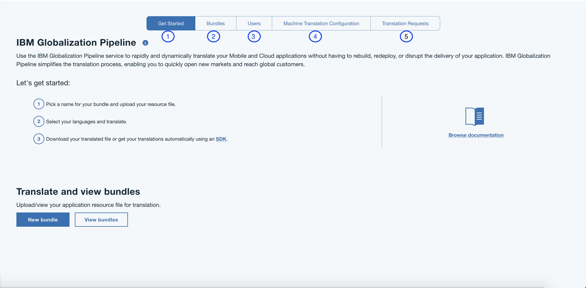
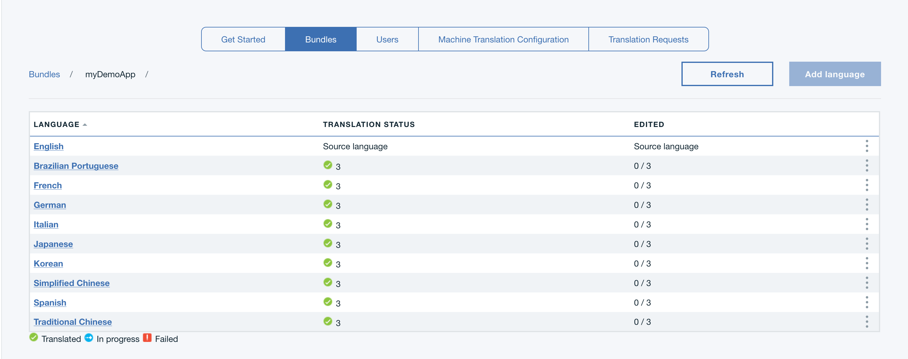
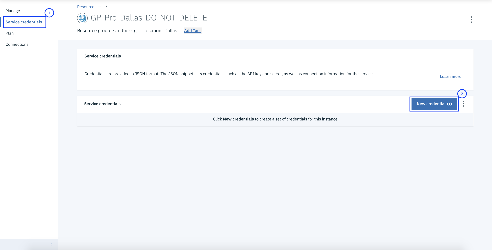
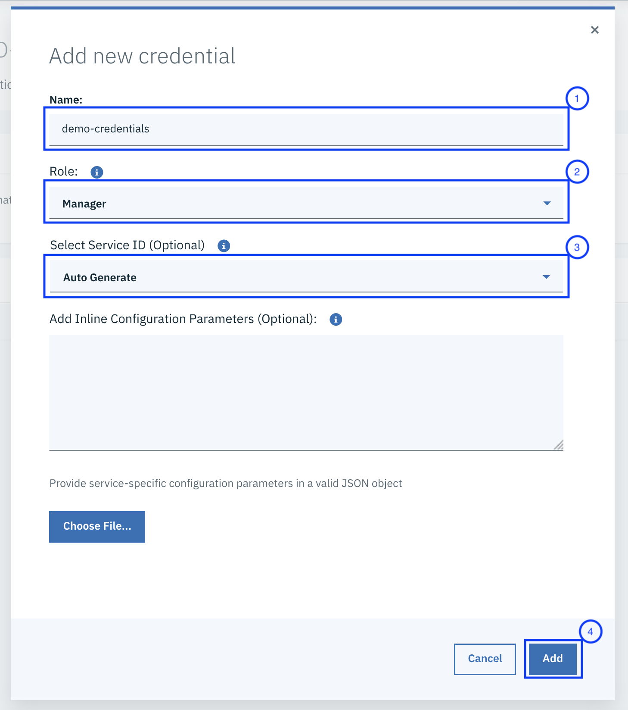
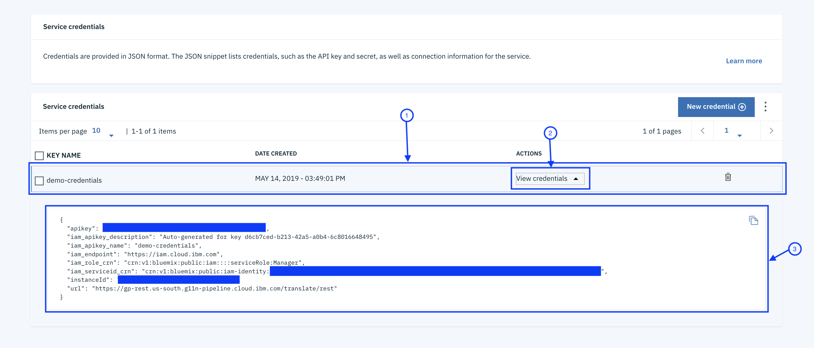

 Globalization Pipeline
======================

<!--  -->

IBM Globalization Pipeline is a DevOps integrated application translation management service that you can use to rapidly translate and release cloud and mobile applications to your global customers. Access IBM Globalization Pipeline capabilities through its dashboard, RESTful API, or integrate it seamlessly into your application's Delivery Pipeline.

This repository contains common files and information for the
[IBM Globalization Pipeline](https://cloud.ibm.com/docs/services/GlobalizationPipeline) service and related tools.

<!-- the download anchor is required for backwards compatibility  -->
SDKs and Plug-ins<a name="download"></a>
----------------------------------------

There are a number of SDKs/Plug-ins available for this service. Select one below for more details on how to use it.

* Python: [SDK](https://github.com/IBM-Cloud/gp-python-client)
* Java: [SDK](https://github.com/IBM-Cloud/gp-java-client) | [Tools](https://github.com/IBM-Cloud/gp-java-tools)
* Angular 1: [SDK](https://github.com/IBM-Cloud/gp-angular-client)
* Angular 2: [SDK](https://github.com/IBM-Cloud/gp-angular2-client)
* Node.js: [SDK](https://github.com/IBM-Cloud/gp-js-client) | [Sample](https://github.com/IBM-Cloud/gp-nodejs-sample) | [Flattener](https://github.com/IBM-Cloud/gp-js-flatten/)
* Cordova: [SDK](https://github.com/IBM-Cloud/gp-cordova-plugin)
* Ruby: [SDK](https://github.com/IBM-Cloud/gp-ruby-client) | [Sample](https://github.com/IBM-Cloud/gp-ruby-sample)
* Jenkins: [Plugin](https://jenkinsci.github.io/ibm-g11n-pipeline-plugin/)
* Urban Code Deploy: [Plugin](https://github.com/IBM-Cloud/gp-ucd-plugin)
* iOS: [SDK](https://github.com/IBM-Cloud/gp-ios-client)

Quick Start Guide
-----------------
Below are some steps to help you quickly get started. For more detailed information about the service, please visit the official [Globalization Pipeline  documentation](https://cloud.ibm.com/docs/services/GlobalizationPipeline) page.

**Lets get started!**

### 1. Create a new Globalization Pipeline service instance
Head to the [IBM Cloud Catalog](https://cloud.ibm.com/catalog?search=Globalization%20Pipeline) and look for the Globalization Pipeline service - it should be under the `Developer Tools` category.


Once you click the service icon, you should be taken to the Globalization Pipeline service page where you will find more information about the service.

On this page:

1. Provide a name for your service instance
2. Choose a region/location where you want to provision service instance
3. Select a resource group you want the service instance to belong to
4. Select a plan
4. Click Create


### 2. Globalization Pipeline Dashboard
Click on the new service instance to go to the Globalization Pipeline **Dashboard**.



1. The **Getting Started** tab provides some general information about the service and some useful links.
2. The **Bundles** tab allows you to view your bundles and create new bundles.
3. The **API Users** tab allows you to create new users with different levels of access to the service instance.
4. The **Machine Translation Configuration** tab can be used to configure additional Machine Translation engines from other
providers, such as [Watson Language Translation](https://cloud.ibm.com/catalog/services/language-translator).
5. The **Translation Requests** can be used to create professional translation requests.

### 3. New Bundle
Lets go ahead and create a new Bundle. Click the **New Bundle** button and then fill in the new Bundle's information:


1. Give the Bundle a unique name so it can be identified later
2. Provide the Resource file that contains your messages
3. Select the Target languages
4. Click Save

In the example above, `messages.json` contains:

```json
{
    "greet": "Hello there!",
    "weather": "It is snowing",
    "exit": "Goodbye"
}
```

Now that the new Bundle is created, select it from the Bundles list to view the Bundle details.



You can now click on one of the Target languages to view the  translated messages in that language. For example, Japanese:


You can now download the translated messages by clicking the **DOWNLOAD** button. Or you can access the translated messages directly in your app by using one of the SDKs or Plug-ins. To get started, head to the [SDKs and Plug-ins](#download) section.

### 4. Credentials
In order to access the service instance through the RESTful API, SDKs, or Plug-ins, you will need to provide the necessary credentials. Globalization Pipeline supports two type of authentication mechanisms, to read more about them refer [this](https://cloud.ibm.com/docs/services/GlobalizationPipeline?topic=GlobalizationPipeline-gp_iam). For generating Globalization Pipeline auth credentials, refer [this](https://cloud.ibm.com/docs/services/GlobalizationPipeline/managetranslations.html#adduser). Here we will be focussing on generating IAM auth credentials. To generate the IAM credentials, find the service instance in the IBM Cloud dashboard and click **Service Credentials** (1) and then **New Credentials** (2):



Lets create the credential:
1. Name of the credential
2. Role you want to assign to it. Refer [this](https://cloud.ibm.com/docs/services/GlobalizationPipeline?topic=GlobalizationPipeline-gp_iam#gp_iam_ovw) for determining the role you need.
3. Auto generate the service id or use an existing one.
4. Press on "Add"


Once the credential is created, you can view it on the same page:
1. In the list of credentials, go to the entry of credential you created.
2. Click on `View credentials`.
3. You will see the credentials.




**Note:** If the service instance is connected to an app on IBM Cloud, the credentials can be accessed from the app's environment variables - the SDKs automatically take care of this.


Contributing
------------
See [CONTRIBUTING.md](CONTRIBUTING.md)

License
-------
Apache 2.0. See [LICENSE.txt](LICENSE.txt)

> Licensed under the Apache License, Version 2.0 (the "License");
> you may not use this file except in compliance with the License.
> You may obtain a copy of the License at
>
> http://www.apache.org/licenses/LICENSE-2.0
>
> Unless required by applicable law or agreed to in writing, software
> distributed under the License is distributed on an "AS IS" BASIS,
> WITHOUT WARRANTIES OR CONDITIONS OF ANY KIND, either express or implied.
> See the License for the specific language governing permissions and
> limitations under the License.
